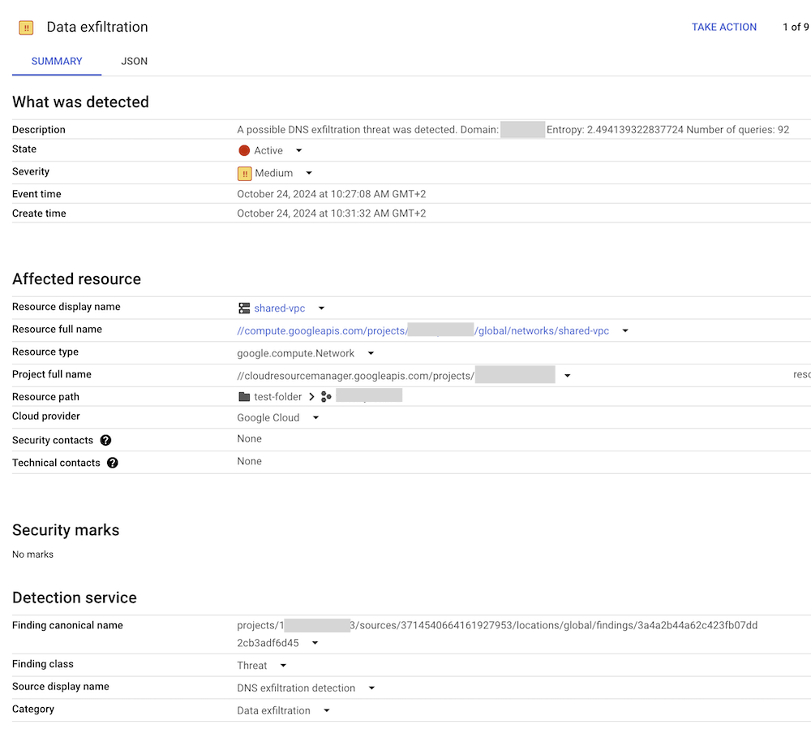

# DNS exfiltration detector



A small application designed to fetch DNS logs from Google Cloud Logging and perform analysis on them
(grouping per TLD, amount of log entries, entropy calculation). Upon detecting a possible DNS exfiltration
attack, the application can create a Response Policy rule to serve local data for the entire TLD and/or
create a finding in Cloud Security Command Center.

## Steps to install

1) Enable DNS logging.
2) Create a Cloud DNS Response Policy (if needed).
3) Create a Cloud Security Command Center source (if needed, see below).
4) Create a service account if run as a function and grant it `roles/dns.admin` in the project with 
   your Response Policy, `roles/securitycenter.findingsEditor` on the organization level and `roles/logging.viewer`
   on the project containing the DNS logs.
5) Configure the application using [`config.yaml`](config.yaml). You can provide the configuration as a string via
   `CONFIG` environment variable.
6) Build the container using the supplied `Dockerfile` or your own.
7) Deploy the function and schedule its execution via Cloud Scheduler.

## Deploy via Terraform

You can use the sample [`variables.tf`](variables.tf) and [`main.tf`](main.tf) to deploy the function via
Terraform.

## Create an SCC source

Easiest is to use the API explorer at: [https://cloud.google.com/security-command-center/docs/reference/rest/v1/organizations.sources/create?rep_location=global](https://cloud.google.com/security-command-center/docs/reference/rest/v1/organizations.sources/create?rep_location=global])

In `parent` field, put your organization: `organizations/12345678`
In the request body, then something like this: 
```
{
  "name": "dns-exfiltration",
  "displayName": "DNS exfiltration detection",
  "description": "DNS exfiltration detection"
}
```

Once you click Execute, you should get back the source ID, which looks like: `organizations/12345678/sources/3714540664161927953`
