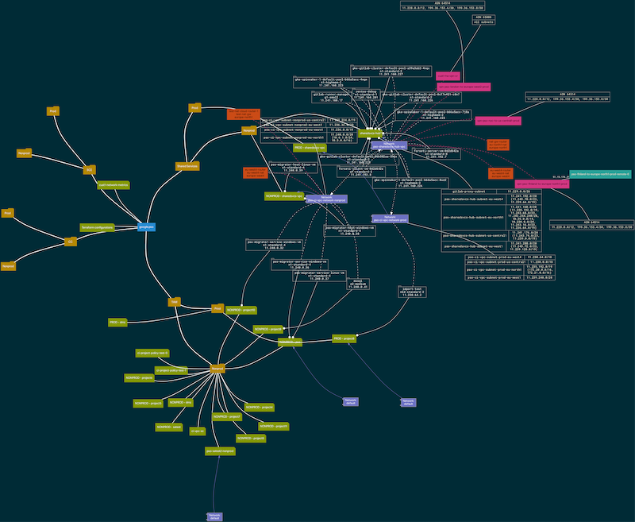
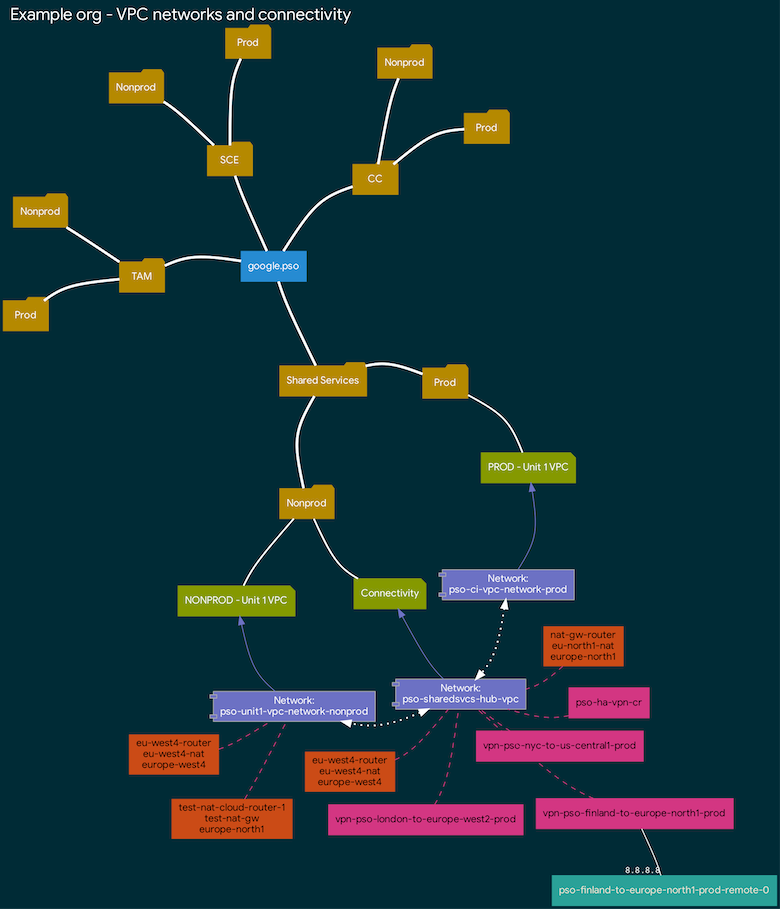
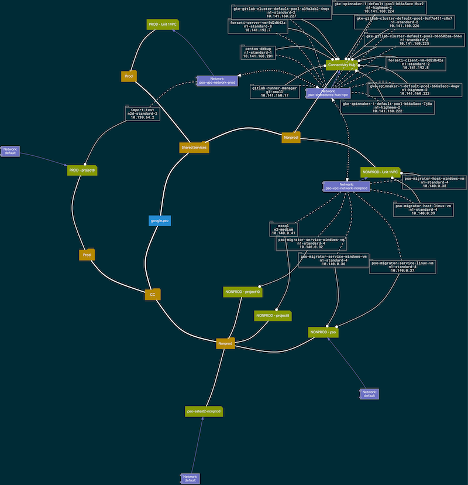

# gcpviz - Cloud Asset Inventory visualization

`gcpviz` is a visualization tool that takes input from [Cloud Asset Inventory](https://cloud.google.com/asset-inventory/docs/overview),
creates relationships between assets and outputs a format compatible with [`graphviz`](http://graphviz.gitlab.io/). It's primary use
is network diagram generation, but it can also list some instances.

If you create a SVG file, the different assets are even clickable, taking you directly into the Cloud Console.

## Requirements

The tool requires the following:
- Python 3
- Graphviz

## Building a Docker image

You can build a Docker image using the supplied `Dockerfile`:

```sh
docker build -t gcr.io/YOUR-PROJECT/gcpviz .
docker push gcr.io/YOUR-PROJECT/gcpviz
```


## Local installation

Install Graphviz: http://graphviz.gitlab.io/download/

Install Python 3 dependencies:

```sh
pip3 install --user -r requirements.txt
```

## Usage

```sh
$ python3 gcpviz.py --help
usage: gcpviz.py [-h] [--file FILE] [--input INPUT] [--title TITLE]
                 [--only_peered_vpc_projects] [--no_empty_projects]
                 [--no_empty_folders] [--include_networks]
                 [--no_default_networks] [--include_subnets]
                 [--include_vms [INCLUDE_VMS [INCLUDE_VMS ...]]]
                 [--link_to_network]
                 [--include_folder [INCLUDE_FOLDER [INCLUDE_FOLDER ...]]]
                 [--include_routers INCLUDE_ROUTERS] [--no_nat_routers]
                 [--subgraphs SUBGRAPHS] [--styles STYLES] [--no_banner]
                 mode

Visualize GCP environments from Cloud Asset Inventory

positional arguments:
  mode                  Operation mode: generate (generate graph file),
                        visualize (create dot file for Graphviz)

optional arguments:
  -h, --help            show this help message and exit
  --file FILE           Graph file name (default gcpviz.graph)
  --input INPUT         Asset inventory input name (default
                        resource_inventory.json)
  --title TITLE         Title of the diagram
  --only_peered_vpc_projects
                        Visualize only projects and networks that are VPC
                        peered
  --no_empty_projects   Supress empty projects
  --no_empty_folders    Supress empty folders
  --include_networks    Include networks
  --no_default_networks
                        Skip "default" networks
  --include_subnets     Include subnetworks with IP ranges
  --include_vms [INCLUDE_VMS [INCLUDE_VMS ...]]
                        Include VM instances in project (can be repeated or
                        specify "all")
  --link_to_network     Link VMs to networks in graph
  --include_folder [INCLUDE_FOLDER [INCLUDE_FOLDER ...]]
                        Include folder (can be repeated; if specified, only
                        listed folders will be listed)
  --include_routers INCLUDE_ROUTERS
                        Show Cloud Routers, eg. VPN and Interconnect
                        (no/yes/full)
  --no_nat_routers      Hide Cloud NAT
  --subgraphs SUBGRAPHS
                        Create subgraphs (no, project)
  --styles STYLES       Use custom styles from YAML file
  --no_banner           Hide application banner
```

## Exporting Cloud Asset Inventory and creating graph

You'll need a Cloud Storage bucket to store the export and `roles/cloudasset.viewer` permission (on
organisational level).  

Then run the command:

```sh
export ORGANIZATION_ID=<YOUR-ORGANIZATION-ID>
export CAI_BUCKET_NAME=<YOUR-BUCKET>
gcloud asset export \
   --content-type resource \
   --organization $ORGANIZATION_ID  \
   --output-path "gs://$CAI_BUCKET_NAME/resource_inventory.json"
```

Copy the `resource_inventory.json` to your machine and generate the graph file:

```sh
python3 gcpviz.py generate --input resource_inventory.json
```

## Creating graphs

The tool has many options - feel free to play around with them until you get the look
you want!

### Create a full visualization of entire cloud landscape



```sh
python3 gcpviz.py visualize --title "Example org - Cloud landscape" \
  --include_vms all \
  --include_subnets \
  --include_networks \
  --link_to_network \
  --include_routers full \
  --styles solarized-style.yaml > landscape.gv \
  && dot -Kneato -Tpng -Gdpi=160 landscape.gv -o landscape.png
```

### Create visualization of network/routing/VPNs



```sh
python3 gcpviz.py visualize --title "Example org - VPC networks and connectivity" \
  --no_empty_projects \
  --no_default_networks \
  --include_networks \
  --include_routers yes \
  --styles solarized-style.yaml > network.gv \
  && dot -Kneato -Tpng -Gdpi=160 network.gv -o network.png
```

### Create visualization of projects and VM instances



```sh
python3 gcpviz.py visualize --title "Example org - Instances" \
  --include_vms all \
  --include_networks \
  --link_to_network \
  --no_empty_folders \
  --no_empty_projects \
  --styles solarized-style.yaml > instances.gv \
  && dot -Kneato -Tpng -Gdpi=160 instances.gv -o instances.png
```

## Tips

- SVG is the best format!
- You can create custom color and shape themes using custom styles (see supplied [`solarized-style.yaml`](solarized-style.yaml))
- You can specify for Graphviz different layout engines, like `dot`, `neato`, `fdp`, `sfdp`, `twopi` or `circo`.
- Do you want to automate your network diagrams? See any example in [.gitlab-ci.yml](gitlab-ci.yml).

## Other resources

See: https://graphviz.gitlab.io/resources/

