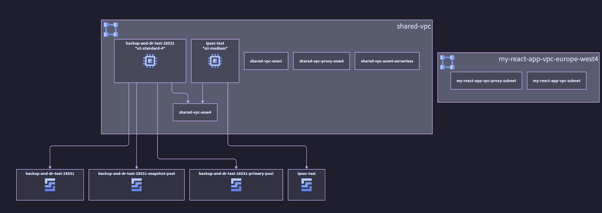

# GCPViz v2

GCPViz v2 is a new version of gcpviz that uses [Cloud Asset Inventory](https://cloud.google.com/asset-inventory/docs/asset-inventory-overview) 
relationship information and BigQuery Graph. It also switches the diagram engine from graphviz to [D2](https://d2lang.com/).



If you construct the graph using the tool, you can use it for more than just visualization. Each resource is connected
via `Owns` or `Relates` edge and you can query the resulting resource graph to answer complex questions about your
cloud landscape.

## Installation and usage

Make sure you have both `bigquery.googleapis.com` and `cloudasset.googleapis.com` enabled:

```sh
export ORGANIZATION_ID=1234567890
export BILLING_PROJECT=my-billing-project
export BQ_PROJECT=my-bq-project
export BQ_DATASET=cai
export BQ_LOCATION=europe-west4
export GCS_BUCKET=gcpviz-${BQ_LOCATION}-$(openssl rand -hex 3)

for service in bigquery.googleapis.com cloudasset.googleapis.com ; do
  echo "Enabling API: $service"
  gcloud services enable $service --project $BQ_PROJECT
done
```

Create the BigQuery dataset (if not already created):

```sh
bq --project_id $BQ_PROJECT mk $BQ_DATASET
```

Then, export all your assets and relationships (make sure you have the correct [IAM permissions](https://cloud.google.com/asset-inventory/docs/roles-permissions)
on the organization level):

```sh

gcloud asset export \
    --organization=$ORGANIZATION_ID \
    --content-type=resource \
    --billing-project=$BILLING_PROJECT \
    --bigquery-table=projects/$BQ_PROJECT/datasets/$BQ_DATASET/tables/assets \
    --output-bigquery-force

gcloud asset export \
    --organization=$ORGANIZATION_ID \
    --content-type=relationship \
    --billing-project=$BQ_PROJECT \
    --bigquery-table=projects/$BQ_PROJECT/datasets/$BQ_DATASET/tables/relationships \
    --output-bigquery-force
```

Then, you have to install dependencies (for `py-d2`, you have to install it from Github for now - otherwise
you won't get icons):

```sh
pip3 install -r requirements.txt
pip3 install git+https://github.com/MrBlenny/py-d2
```

Now, install D2 according to the instructions here: [Install D2](https://github.com/terrastruct/d2/blob/master/docs/INSTALL.md)

## Usage via command line

Then run the the tool to create the views and property graph:

```sh
python3 gcpviz.py -project $BQ_PROJECT \
  -dataset $BQ_DATASET \
  -relationship_table relationships \
  -location $BQ_LOCATION
```

Finally, generate a graph (the supplied [`query.yaml`](query.yaml) fetches the assets
in the above example image):

```sh
python3 gcpviz.py -project $BQ_PROJECT \
  -dataset cai \
  -relationship-table relationship \
  -location $BQ_LOCATION \
  -query-file query.yaml \
  -graph-file graph.d2
```

Afterwards, you should get a D2 file called `graph.d2`, which you can convert to a SVG using
(don't forget to get the icons, see below):

```sh
d2 -l elk graph.d2 graph.svg
```

(note that even for a small amount of resources, it can take quite a while for D2 to 
`info: compiling & running layout algorithms...` and eventually timeout
if this happens, cut down on the resources by specifying more exclusion filters in the
[query YAML](query.yaml) - or just specify an inclusion filter to only get the resource
you need)

Once you have created the graph initially and have not updated the datasets, you can
add `--skip-graph-create` to just perform the query.

If you want to use Tala engine, install it using these instructions: [Tala installation](https://github.com/terrastruct/tala#installation)

## Getting the icons

Download the SVG and PNG icons from here: [cloud.google.com/icons](https://cloud.google.com/icons)

Place the icons in `google-cloud-icons` directory (eg. `google-cloud-icons/asset_inventory/asset_inventory.png`).

## Usage via Cloud Run job

A `Dockerfile` has been provided for usage with Cloud Run. Build the container and push it to Artifact Registry:

```sh
gcloud artifacts repositories create gcpviz-v2 \
  --repository-format=DOCKER \
  --location $BQ_LOCATION \
  --project $BQ_PROJECT

docker build --platform=amd64 -t ${BQ_LOCATION}-docker.pkg.dev/${BQ_PROJECT}/gcpviz-v2/gcpviz:latest .
docker push ${BQ_LOCATION}-docker.pkg.dev/${BQ_PROJECT}/gcpviz-v2/gcpviz:latest
```

Create a GCS bucket for results:

```sh
gcloud storage buckets create gs://$GCS_BUCKET \
  --public-access-prevention \
  --uniform-bucket-level-access \
  --location=$BQ_LOCATION \
  --project=$BQ_PROJECT
```

And a service account with BigQuery access:

```sh
gcloud iam service-accounts create gcpviz-v2 \
  --description="GCPViz V2 visualization tool" \
  --display-name="Visualization tool" \
  --project=$BQ_PROJECT

gcloud projects add-iam-policy-binding $BQ_PROJECT \
  --member="serviceAccount:gcpviz-v2@${BQ_PROJECT}.iam.gserviceaccount.com" \
  --role="roles/bigquery.jobUser" \
  --project=$BQ_PROJECT

gcloud projects add-iam-policy-binding $BQ_PROJECT \
  --member="serviceAccount:gcpviz-v2@${BQ_PROJECT}.iam.gserviceaccount.com" \
  --role="roles/bigquery.dataEditor" \
  --project=$BQ_PROJECT
```

Create a default Cloud Run job for the tool:

```sh
gcloud run jobs create gcpviz-v2 \
  --image ${BQ_LOCATION}-docker.pkg.dev/${BQ_PROJECT}/gcpviz-v2/gcpviz:latest \
  --service-account="gcpviz-v2@${BQ_PROJECT}.iam.gserviceaccount.com" \
  --set-env-vars GCPVIZ_DATASET=$BQ_DATASET,GCPVIZ_CAI_TABLE=assets,GCPVIZ_RELATIONSHIPS_TABLE=relationships,GCPVIZ_RESULT_BUCKET=$GCS_BUCKET,GOOGLE_PROJECT=$BQ_PROJECT,GOOGLE_REGION=$BQ_LOCATION,GCPVIZ_LOG_LEVEL=info,GCPVIZ_QUERY=,GCPVIZ_PARTIAL_QUERY=,GCPVIZ_QUERY_PARAMETERS=,D2_FLAGS= \
  --region $BQ_LOCATION \
  --project $BQ_PROJECT
```

You can now use the job to execute a query:

```sh
gcloud run jobs execute gcpviz-v2 \
  --update-env-vars="^##^GCPVIZ_QUERY=$(cat query.yaml)" \
  --region $BQ_LOCATION \
  --project $BQ_PROJECT
```

(you can also use `GCPVIZ_PARTIAL_QUERY` to merge a query on top on an existing one stored on
the container)

## Queries

The query language is [GQL](https://cloud.google.com/spanner/docs/reference/standard-sql/graph-intro), with
some limitations.

### GQL sample queries

Dump some nodes from the graph:

```sql
GRAPH cai.asset_graph

MATCH
  (s)-[e]->(d)
RETURN TO_JSON(s) AS s, TO_JSON(d) AS d, TO_JSON(e) AS e
LIMIT 100
```

Returns all directed edges:

```sql
GRAPH cai.asset_graph
MATCH
 (s)-[e]->(d)
RETURN
 s.name AS src_name, d.name AS dst_name
```

Same in SQL:

```sql
SELECT src_name, dst_name
FROM GRAPH_TABLE(
  cai.asset_graph
  MATCH
    (s)-[e]->(d)
  RETURN s.name AS src_name, d.name AS dst_name
)
```

Return all assets with source and destination edges:

```sql
SELECT
  assets.*,
  edges.src_name,
  edges.dst_name
FROM
  cai.cai AS assets
LEFT JOIN (
  SELECT
    src_name,
    dst_name
  FROM
    GRAPH_TABLE( cai.asset_graph MATCH (s)-[e]->(d) RETURN s.name AS src_name,
      d.name AS dst_name ) ) AS edges
ON
  edges.src_name = assets.name
```

Return all assets with source and destination edges from one project:

```sql
SELECT
  assets.*,
  edges.src_name,
  edges.dst_name
FROM
  cai.cai AS assets
LEFT JOIN (
  SELECT
    src_name,
    dst_name
  FROM
    GRAPH_TABLE( cai.asset_graph MATCH (s)-[e]->(d) RETURN s.name AS src_name,
      d.name AS dst_name ) ) AS edges
ON
  edges.src_name = assets.name
```

All connected resources of one project:

```sql
GRAPH cai.asset_graph
MATCH
 (s:CloudresourcemanagerProject {name: "//cloudresourcemanager.googleapis.com/projects/1069720238363"})-[e]->(d)
RETURN
 s.name AS src_name, d.name AS dst_name
```

And same in SQL:

```sql
SELECT
  assets.*,
  edges.src_name,
  edges.dst_name
FROM
  cai.cai AS assets
LEFT JOIN (
  SELECT
    src_name,
    dst_name
  FROM
    GRAPH_TABLE( cai.asset_graph MATCH (s:CloudresourcemanagerProject {name: "//cloudresourcemanager.googleapis.com/projects/1069720238363"})-[e]->(d) RETURN s.name AS src_name,
      d.name AS dst_name ) ) AS edges
ON
  edges.src_name = assets.name
```